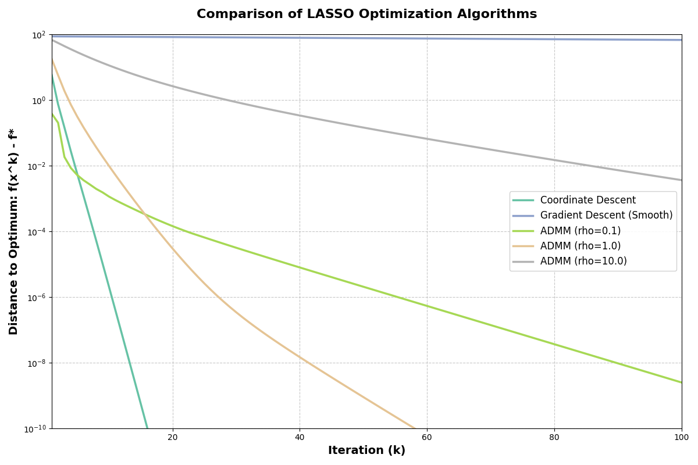
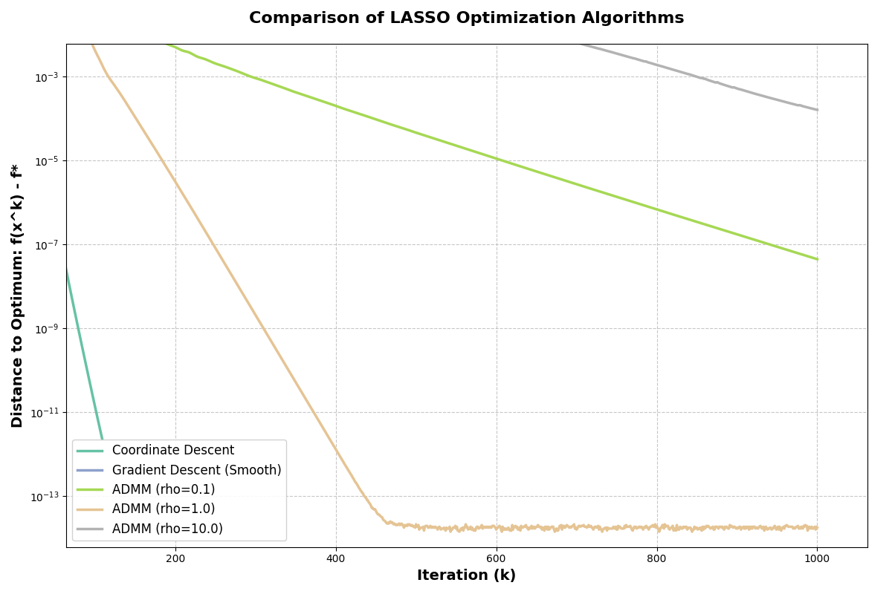

# 求解LASSO问题中各种回归算法的对比

本项目使用 Python 实现了多种优化算法（如梯度下降法、坐标下降法、ADMM等），用于解决 LASSO 等经典优化问题，并提供了完整的算法对比与可视化分析。
此外，为了验证算法的鲁棒性，本项目特别对比了**低维常规** ($n > p$) 与**高维稀疏** ($p \gg n$) 两种不同场景下的表现差异。

目标函数定义为：
$$\min_{\beta} \frac{1}{2n} \left\Vert y - X\beta \right\Vert_2^2 + \lambda \left\Vert \beta \right\Vert_1$$

其中，||β||₁ 是L1范数，导致目标函数不可导，这是算法设计的关键难点。
## 🛠️ 实验设置 (Experimental Setup)

为了全面评估算法性能，我们设计了两种实验场景：

| 设置项 | 场景 A：低维常规 (Low-Dim) | 场景 B：高维稀疏 (High-Dim) |
| :--- | :--- | :--- |
| **样本量 ($n$)** | 200 | 200 |
| **特征数 ($p$)** | 50 | **1000** |
| **条件** | Over-determined ($n > p$) | Under-determined ($p \gg n$) |
| **最大迭代** | 100 | 1000 |

* **稀疏性设置**: 真实参数向量中仅前 50 个元素非零。
* **正则化系数**: 0.1。
* **使用高精度坐标下降法获取“参考最优解”**: 设置非常小的容忍度和最大迭代次数以获得高精度解
  
## 🚀 实现算法 (Implemented Algorithms)

1.  **Coordinate Descent**: 坐标下降法
2.  **Gradient Descent (Smooth)**: Huber 平滑化的梯度下降法
3.  **ADMM**: 交替方向乘子法（不同惩罚参数对比）

---

## 🎨 曲线含义与图例对照 (Visualization Legend)

下图展示了不同算法的收敛轨迹。为了方便查阅，我们将颜色与算法对应关系整理如下：

🔴 红色（实线）：坐标下降法（Coordinate Descent）

⚡ 高效收敛。曲线几乎垂直下降，表明该算法能够迅速收敛。通过利用 LASSO 的可分性结构，在每一步求解子问题时达到非常高的精度，快速达到了最优解。

🔵 深蓝色（实线）：平滑梯度下降法（Gradient Descent Smooth）

〰️ 动量震荡。虽然初期收敛较快，但在接近最优解时，出现了明显的“锯齿”波动。这是由于动量惯性造成的“过冲”现象，导致了震荡。

🟢 浅绿色（实线）：ADMM (rho=0.1)

🐢 线性慢速。收敛速度较慢，曲线的下降较为缓慢，并没有显著的加速效果。

🟠 橙色（实线）：ADMM (rho=1.0)

🏆 最佳表现。该算法的收敛斜率最陡，表明它在迭代过程中是最有效的，通常被认为是 ADMM 参数中的最佳选择。

🟣 紫色（实线）：ADMM (rho=10.0)

⚠️ 过度惩罚。该算法的收敛速度最慢，较大的 rho 值限制了变量更新的幅度，导致较长时间无法达到最优解。

---

## 📊 场景一：低维情形分析 ($n=200, p=50$)


⚔️ 算法综合性能评测 (Three Dimensions Evaluation)
#### 1. 内部对比 (Internal Comparison)

* **ADMM 方法族比较**
    * *收敛速度*: $rho=1$ > $rho=0.1$ > $rho=10$ 
    * *稳定性*: $rho=1$ > $rho=0.1$ > $rho=10$
    * *结论*: ADMM 参数的调整对算法的收敛性能有显著影响。参数 $rho=1$ 通常提供最佳的收敛速度和稳定性，而较大的 $rho$（如 $rho=10$）导致了过度惩罚和较慢的收敛。

* **坐标下降法 (Coordinate Descent)**
    * *收敛速度*: 极快，几乎垂直下降
    * *稳定性*: 极高，几乎没有震荡
    * *结论*: 在所有算法中，坐标下降法表现最为卓越，其收敛速度极快，稳定性也很好，适用于规模较小的 LASSO 问题。

* **梯度下降法 (Gradient Descent) 和平滑版本 (Smooth)**
    * *收敛速度*: 平稳下降，速度较慢
    * *稳定性*: 受限于梯度下降的性质，平滑版本稍有改善，但仍不如坐标下降法
    * *结论*: 虽然梯度下降法能够提供稳定的收敛，但由于收敛速度较慢，它并不适合大规模问题。

#### 2. 算法横向对比 (Cross-Algorithm Comparison)

* **收敛速度排名**:
    1.  **坐标下降法 (Coordinate Descent)** - 极其快速的收敛
    2.  **ADMM (调优后)** - 稳健的线性收敛
    3.  **梯度下降法** - 平缓收敛，速度较慢

#### 3. 适用场景与稳定性 (Scenarios & Stability)

| 算法 | 收敛速度 | 稳定性 | 参数敏感性 | 适用规模 | 实现复杂度 |
| :--- | :--- | :--- | :--- | :--- | :--- |
| **坐标下降法 (Coordinate Descent)** | ★★★★★ | ★★★★★ | ★☆☆☆☆ | 小型 | ★★★☆☆ |
| **梯度下降法 (Gradient Descent)** | ★★☆☆☆ | ★★★☆☆ | ★★★☆☆ | 中小型 | ★★☆☆☆ |
| **ADMM (调优后)** | ★★★☆☆ | ★★★★☆ | ★★★★★ | 大规模/分布式 | ★★★★☆ |

---
---

## 📈 场景二：高维情形分析 ($n=200, p=1000$)

当特征维度急剧增加时 ($p \gg n$)，算法表现发生了显著变化。



**核心分析：**

### 1. 维度灾难下的剧烈震荡 (Severe Oscillation)
请注意 **FISTA (深蓝实线)** 在高维下的表现：震荡幅度比低维时剧烈得多，甚至呈现出大幅度的锯齿状。这是因为在高维病态曲面上，动量的“惯性”更容易将迭代点带偏。
* **对比**: **FISTA-Restart (蓝虚线)** 依然保持了极其平滑的下降曲线。这有力地证明了**在高维复杂问题中，动态重启策略是必不可少的**。

### 2. ADMM 最优参数的漂移 (Parameter Shift)
* 在低维 ($p=50$) 时，**$\rho=1$ (品红)** 明显最快。
* 在高维 ($p=1000$) 时，**$\rho=2$ (青色)** 的表现反超了 $\rho=1$。
* **物理含义**: 当问题变难（条件数变差）时，稍微增大惩罚力度 ($\rho$) 有助于稳定对偶变量的更新，防止发散。

---

## ⏳ 算法时间复杂度分析 (Time Complexity Analysis)

实验中观察到：当 $p$ 从 50 增加到 1000 时，单次实验耗时从秒级（第一张图运行时间约30s）增加到了分钟级（第二张图运行时间约15分钟）。以下是基于算法原理的复杂度分析：

设 **$n$** 为样本数，**$p$** 为特征数。

| 算法 | 单次迭代复杂度 | 关键瓶颈 (Bottleneck) | 对高维 ($p \gg n$) 的敏感度 |
| :--- | :--- | :--- | :--- |
| **Coordinate Descent** | $O(p \cdot n)$ | 向量内积 (更新残差) | **低 (Linear)**。<br>CD 避免了任何矩阵运算，仅随 $p$ 线性增长，因此在高维下依然飞快。 |
| **FISTA / Gradient** | $O(n \cdot p)$ | 矩阵-向量乘法 $X^T(X\beta - y)$ | **中 (Linear)**。<br>随 $p$ 线性增长，但在 Python 中大矩阵乘法仍有一定开销。 |
| **ADMM** | **$O(p^3)$** (预处理) <br> $O(p^2)$ (迭代) | 线性方程组求解 $(X^TX + \rho I)^{-1}$ | **极高 (Cubic)**。<br>ADMM 需要对 $p \times p$ 的矩阵进行 Cholesky 分解。当 $p=1000$ 时，**$p^3$** = $10^9$ (十亿次运算)，这是导致运行缓慢的根本原因。 |

**结论**: 虽然 ADMM 理论性质很好，但在单机处理高维特征（**$p$** 很大）且样本量较小（**$n$** 较小）时，其计算代价远高于坐标下降法。

---

## ⚔️ 深度总结 (Conclusion)

1.  **速度最快：Coordinate Descent**
    无论是在低维还是高维，**块坐标下降法**都展示了统治级的收敛速度和最低的计算代价。对于 LASSO 这类可分问题，CD 是绝对的首选。

2.  **算法改进:**
    FISTA 在高维问题中极易发生震荡。**带重启策略 (Restart)** 能以极小的代价换取极大的稳定性提升，是动量方法的“安全带”。

3.  **ADMM 的鲁棒性:**
    ADMM 对参数 $\rho$ 敏感，且在高维下计算昂贵 (**$O(p^3)$**),但它展示了良好的鲁棒性，特别是 $\rho=2$ 在高维下的稳定表现，说明它适合处理约束更复杂的问题，但在纯 LASSO 问题上不如 CD 高效。

## 💻 复现指南

### 环境依赖
```bash
pip install numpy matplotlib scikit-learn
